```mermaid
erDiagram
    %% Core Multi-Tenant Tables
    Tenant ||--o{ User : "has many"
    Tenant ||--o| LicenseTier : "subscription_tier"
    Tenant ||--o{ TenantIntegrationConfig : "has many"
    
    %% License & User Tables
    LicenseTier ||--o{ User : "assigned to"
    LicenseTier ||--o{ LicenseTierFeatures : "includes"
    
    %% Feature Control Tables
    FeatureRegistry ||--o{ LicenseTierFeatures : "referenced by"
    FeatureRegistry ||--o{ ModelRegistry : "maps to (FK)"
    FeatureRegistry ||--o{ ComponentRegistry : "maps to (FK)"
    FeatureRegistry ||--o{ IntegrationRegistry : "maps to (FK)"
    FeatureRegistry ||--o{ FeatureAuditLog : "audited in"
    
    %% Registry Tables
    IntegrationRegistry ||--o{ TenantIntegrationConfig : "configured in"
    
    %% Audit & User References
    User ||--o{ FeatureRegistry : "created_by"
    User ||--o{ LicenseTierFeatures : "created_by"
    User ||--o{ TenantIntegrationConfig : "created_by"
    User ||--o{ FeatureAuditLog : "performed_by"
    
    %% Table Definitions
    Tenant {
        UUID id PK
        string name
        string slug UK
        boolean is_active
        int max_users
        JSON license_pools
        UUID subscription_tier_id FK
        int subscription_license_count
        string subscription_status
        datetime created_at
        datetime updated_at
    }
    
    User {
        UUID id PK
        string username UK
        string password
        UUID tenant_id FK
        boolean is_tenant_admin
        boolean is_platform_superadmin
        UUID license_tier_id FK
        UUID license_pool_id
        int credits_allocated
        int credits_used
        int credits_per_month
        boolean license_is_active
        datetime license_expires_at
        datetime created_at
        datetime updated_at
    }
    
    LicenseTier {
        UUID id PK
        string name UK
        string description
        decimal token_price_per_1000
        decimal credits_per_usd
        decimal pricing_multiplier
        int default_credits
        int default_credits_per_month
        int max_users
        int max_flows
        int max_api_calls
        JSON features
        boolean is_active
        UUID created_by FK
        datetime created_at
        datetime updated_at
    }
    
    FeatureRegistry {
        UUID id PK
        string feature_key UK
        string feature_name
        string description
        string category
        string subcategory
        string feature_type
        JSON default_value
        boolean is_premium
        boolean requires_setup
        JSON depends_on
        JSON conflicts_with
        int display_order
        string icon
        string help_url
        boolean is_active
        boolean is_deprecated
        string deprecated_message
        UUID created_by FK
        datetime created_at
        datetime updated_at
    }
    
    LicenseTierFeatures {
        UUID id PK
        UUID license_tier_id FK
        string feature_key FK
        JSON feature_value
        UUID created_by FK
        datetime created_at
        datetime updated_at
    }
    
    ModelRegistry {
        UUID id PK
        string provider
        string model_id
        string model_name
        string model_type
        string model_family
        boolean supports_tools
        boolean supports_vision
        boolean supports_streaming
        int max_tokens
        int context_window
        decimal input_price_per_1k
        decimal output_price_per_1k
        string feature_key FK
        boolean is_active
        boolean is_deprecated
        datetime created_at
        datetime updated_at
    }
    
    ComponentRegistry {
        UUID id PK
        string component_key UK
        string component_name
        string display_name
        string description
        string category
        string subcategory
        string feature_key FK
        JSON required_features
        string icon
        string documentation_url
        boolean is_beta
        boolean is_active
        datetime created_at
        datetime updated_at
    }
    
    IntegrationRegistry {
        UUID id PK
        string integration_key UK
        string integration_name
        string description
        string category
        string feature_key FK
        JSON config_schema
        JSON required_features
        string icon
        string documentation_url
        string setup_guide_url
        boolean is_active
        boolean is_beta
        datetime created_at
        datetime updated_at
    }
    
    TenantIntegrationConfig {
        UUID id PK
        UUID tenant_id FK
        string integration_key FK
        JSON config
        binary encrypted_config
        boolean is_enabled
        datetime last_health_check
        string health_status
        UUID created_by FK
        datetime created_at
        datetime updated_at
    }
    
    FeatureAuditLog {
        UUID id PK
        string entity_type
        UUID entity_id
        string feature_key
        string action
        JSON old_value
        JSON new_value
        UUID performed_by FK
        datetime performed_at
        string reason
        string ip_address
        string user_agent
    }
```

# Tenant Feature Control System - Entity Relationship Diagram (ERD)

> **Document Version**: 1.0  
> **Last Updated**: January 2025

---

## Overview

This document provides a comprehensive Entity Relationship Diagram (ERD) for the Tenant Feature Control System. The system enables granular control over features, models, components, and integrations through a license tier-based inheritance model.

---

## ERD Diagram


---

## Table Relationships

### 1. Core Multi-Tenant Structure

```
Tenant (1) ──< (N) User
  ├─ Each tenant has many users
  └─ Users belong to one tenant

Tenant (N) ──< (1) LicenseTier [subscription_tier]
  ├─ Tenant can have a subscription tier
  └─ Multiple tenants can use same tier
```

### 2. License & Feature Inheritance

```
LicenseTier (1) ──< (N) User
  ├─ Users are assigned to a license tier
  └─ Multiple users can share same tier

LicenseTier (1) ──< (N) LicenseTierFeatures
  ├─ Each tier has many feature configurations
  └─ Features are tier-specific

FeatureRegistry (1) ──< (N) LicenseTierFeatures
  ├─ Features are defined in registry (source of truth)
  └─ Tier features reference registry features
```

### 3. Feature-to-Resource Mapping

```
FeatureRegistry (1) ──< (N) ModelRegistry
  ├─ Models are mapped to feature keys
  └─ e.g., "models.openai" → OpenAI models

FeatureRegistry (1) ──< (N) ComponentRegistry
  ├─ Components are mapped to feature keys
  └─ e.g., "components.custom.enabled" → Custom components

FeatureRegistry (1) ──< (N) IntegrationRegistry
  ├─ Integrations are mapped to feature keys
  └─ e.g., "integrations.mcp" → MCP servers
```

### 4. Tenant-Specific Configurations

```
Tenant (1) ──< (N) TenantIntegrationConfig
  ├─ Each tenant can configure integrations
  └─ Stores encrypted credentials/configs

IntegrationRegistry (1) ──< (N) TenantIntegrationConfig
  ├─ Configs reference integration registry
  └─ One config per tenant per integration
```

### 5. Audit Trail

```
FeatureRegistry (1) ──< (N) FeatureAuditLog
  ├─ All feature changes are logged
  └─ Tracks who, what, when, why

User (1) ──< (N) FeatureAuditLog
  ├─ Tracks who made changes
  └─ Includes IP and user agent
```

---

## Key Design Patterns

### 1. **Feature Inheritance Model**

```
Global Feature Registry (Source of Truth)
         │
         ├─> License Tier Features (What each tier includes)
         │        │
         │        └─> User (Inherits from tier)
         │
         ├─> Model Registry (Maps models to features)
         ├─> Component Registry (Maps components to features)
         └─> Integration Registry (Maps integrations to features)
```

**Flow:**
1. Features defined in `feature_registry` (global)
2. Super Admin assigns features to tiers in `license_tier_features`
3. Users inherit features via `user.license_tier_id`
4. Resources (models/components/integrations) reference feature keys
5. System checks user's tier → tier features → feature enabled?

### 2. **Registry Pattern**

All resources (models, components, integrations) are registered with:
- A `feature_key` that maps to `feature_registry`
- Metadata (capabilities, pricing, status)
- Status flags (`is_active`, `is_deprecated`)

This allows:
- Centralized feature-to-resource mapping
- Easy filtering: "Show only models where user has feature"
- Dynamic feature discovery

### 3. **Tier-Based Access Control**

```
User → LicenseTier → LicenseTierFeatures → FeatureRegistry
```

**Example:**
- User `alice` has `license_tier_id = "enterprise-tier"`
- `enterprise-tier` has `license_tier_features`:
  - `models.openai` = `true`
  - `models.anthropic` = `true`
  - `integrations.mcp` = `true`
- User `bob` has `license_tier_id = "basic-tier"`
- `basic-tier` has `license_tier_features`:
  - `models.openai` = `true`
  - `models.anthropic` = `false`
  - `integrations.mcp` = `false`

### 4. **Audit Trail**

Every feature change is logged in `feature_audit_log`:
- **Entity**: What changed (tier, tenant, registry)
- **Action**: enable, disable, update, request
- **Values**: Old and new values
- **Context**: Who, when, why, IP, user agent

---

## Indexes

### Performance-Critical Indexes

```sql
-- Feature Registry
CREATE INDEX idx_feature_registry_category ON feature_registry(category);
CREATE UNIQUE INDEX idx_feature_registry_key ON feature_registry(feature_key);

-- License Tier Features
CREATE INDEX idx_tier_features_tier ON license_tier_features(license_tier_id);
CREATE INDEX idx_tier_features_tier_key ON license_tier_features(license_tier_id, feature_key);

-- Model Registry
CREATE INDEX idx_model_registry_provider ON model_registry(provider);
CREATE INDEX idx_model_registry_feature ON model_registry(feature_key);

-- Component Registry
CREATE INDEX idx_component_registry_category ON component_registry(category);
CREATE INDEX idx_component_registry_feature ON component_registry(feature_key);

-- User (for feature resolution)
CREATE INDEX idx_user_license_tier ON "user"(license_tier_id);
CREATE INDEX idx_user_tenant ON "user"(tenant_id);

-- Tenant Integration Configs
CREATE INDEX idx_tenant_integration_active ON tenant_integration_configs(tenant_id, is_enabled) WHERE is_enabled = true;

-- Audit Log
CREATE INDEX idx_feature_audit_entity ON feature_audit_log(entity_type, entity_id);
CREATE INDEX idx_feature_audit_time ON feature_audit_log(performed_at);
CREATE INDEX idx_feature_audit_key_time ON feature_audit_log(feature_key, performed_at DESC);
```

---

## Foreign Key Constraints

### Cascade Deletes

```sql
-- License Tier Features
license_tier_features.license_tier_id → license_tier.id ON DELETE CASCADE
license_tier_features.feature_key → feature_registry.feature_key ON DELETE CASCADE

-- Tenant Integration Configs
tenant_integration_configs.tenant_id → tenant.id ON DELETE CASCADE
tenant_integration_configs.integration_key → integration_registry.integration_key ON DELETE RESTRICT

-- Feature Key References (Data Integrity)
model_registry.feature_key → feature_registry.feature_key ON DELETE RESTRICT
component_registry.feature_key → feature_registry.feature_key ON DELETE RESTRICT
integration_registry.feature_key → feature_registry.feature_key ON DELETE RESTRICT
```

### Restrict Deletes

```sql
-- User references
user.license_tier_id → license_tier.id (no cascade - prevent tier deletion if users assigned)
user.tenant_id → tenant.id (no cascade - prevent tenant deletion if users exist)
```

---

## Data Flow Examples

### Example 1: User Feature Resolution

```sql
-- Step 1: Get user's tier
SELECT license_tier_id FROM "user" WHERE id = 'user-123';
-- Returns: 'tier-enterprise'

-- Step 2: Get tier features
SELECT feature_key, feature_value 
FROM license_tier_features 
WHERE license_tier_id = 'tier-enterprise';
-- Returns: 
--   models.openai → true
--   models.anthropic → true
--   integrations.mcp → true

-- Step 3: Check specific feature
SELECT feature_value 
FROM license_tier_features 
WHERE license_tier_id = 'tier-enterprise' 
  AND feature_key = 'models.openai';
-- Returns: {"enabled": true}
```

### Example 2: Filter Models by User Features

```sql
-- Get user's enabled features
WITH user_features AS (
  SELECT ltf.feature_key
  FROM license_tier_features ltf
  JOIN "user" u ON u.license_tier_id = ltf.license_tier_id
  WHERE u.id = 'user-123'
    AND ltf.feature_value->>'enabled' = 'true'
)
-- Get available models
SELECT mr.*
FROM model_registry mr
WHERE mr.feature_key IN (SELECT feature_key FROM user_features)
  AND mr.is_active = true;
```

### Example 3: Audit Feature Change

```sql
-- When Super Admin enables a feature for a tier
INSERT INTO feature_audit_log (
  entity_type, entity_id, feature_key, action,
  old_value, new_value, performed_by, reason
) VALUES (
  'tier', 'tier-enterprise', 'models.anthropic', 'enable',
  '{"enabled": false}', '{"enabled": true}',
  'admin-user-id', 'Upgraded tier to include Anthropic models'
);
```

---

## Constraints & Business Rules

### Unique Constraints

1. **Feature Registry**
   - `feature_key` must be unique globally

2. **License Tier Features**
   - `(license_tier_id, feature_key)` must be unique
   - One tier cannot have duplicate feature entries

3. **Model Registry**
   - `(provider, model_id)` must be unique
   - Same model from same provider cannot be registered twice
   - **Note**: `model_name` is NOT unique (different providers can have same model name)

4. **Component Registry**
   - `component_key` must be unique

5. **Integration Registry**
   - `integration_key` must be unique

6. **Tenant Integration Configs**
   - `(tenant_id, integration_key)` must be unique
   - One config per tenant per integration

### Referential Integrity

- **Feature Keys**: All `feature_key` references must exist in `feature_registry`
- **License Tiers**: All `license_tier_id` references must exist in `license_tier`
- **Users**: All `created_by` references must exist in `user`
- **Tenants**: All `tenant_id` references must exist in `tenant`

### Business Rules

1. **Feature Inheritance**: Users inherit ALL features from their assigned tier
2. **Default Values**: If a feature is not in `license_tier_features`, use `feature_registry.default_value`
3. **Active Status**: Only `is_active = true` resources are available
4. **Premium Features**: `is_premium = true` features require paid tiers
5. **Dependencies**: Features with `depends_on` require parent features to be enabled
6. **Conflicts**: Features with `conflicts_with` cannot be enabled together

---

## Migration History

The feature control tables were added in migration:
- **Revision**: `c4d5e6f7a8b9`
- **File**: `c4d5e6f7a8b9_add_feature_control_tables.py`
- **Date**: 2025-01-15

---

## Related Documentation

- [architecture.md](./architecture.md) - System architecture overview
- [erd-critical-analysis.md](./erd-critical-analysis.md) - Critical analysis & optimization recommendations
- [extensibility-guide.md](./extensibility-guide.md) - Implementation patterns
- [implementation-audit.md](./implementation-audit.md) - Production readiness audit

---

## Notes

1. **JSON Fields**: Several tables use JSON/JSONB for flexible schema:
   - `feature_value` in `license_tier_features` (supports boolean, integer, string, object)
   - `license_pools` in `tenant` (stores pool metadata)
   - `config` in `tenant_integration_configs` (integration-specific configs)

2. **Encrypted Fields**: `tenant_integration_configs.encrypted_config` stores sensitive credentials encrypted at rest. The `config` field stores non-sensitive configuration (URLs, public keys), while `encrypted_config` stores secrets (API keys, passwords).

3. **Soft Deletes**: Tables use `is_active` and `is_deprecated` flags instead of hard deletes for auditability

4. **Audit Trail**: All feature changes are logged for compliance and debugging

5. **Multi-Tenancy**: System supports multiple tenants, each with isolated feature configurations

6. **TenantIntegrationConfig**: Stores tenant-specific configuration and credentials for third-party integrations (MCP servers, Langfuse, vector stores, etc.). Each tenant can have one config per integration type. See [tenant-integration-config.md](./tenant-integration-config.md) for detailed explanation.

## ⚠️ Known Issues & Optimizations

See [erd-critical-analysis.md](./erd-critical-analysis.md) for a comprehensive analysis of:
- Missing indexes and foreign key constraints
- Design inconsistencies
- Performance optimization opportunities
- Data integrity concerns


> **Document Version**: 1.0  
> **Last Updated**: January 2025

---

## Overview

This document provides a comprehensive Entity Relationship Diagram (ERD) for the Tenant Feature Control System. The system enables granular control over features, models, components, and integrations through a license tier-based inheritance model.

---

## ERD Diagram



---

## Table Relationships

### 1. Core Multi-Tenant Structure

```
Tenant (1) ──< (N) User
  ├─ Each tenant has many users
  └─ Users belong to one tenant

Tenant (N) ──< (1) LicenseTier [subscription_tier]
  ├─ Tenant can have a subscription tier
  └─ Multiple tenants can use same tier
```

### 2. License & Feature Inheritance

```
LicenseTier (1) ──< (N) User
  ├─ Users are assigned to a license tier
  └─ Multiple users can share same tier

LicenseTier (1) ──< (N) LicenseTierFeatures
  ├─ Each tier has many feature configurations
  └─ Features are tier-specific

FeatureRegistry (1) ──< (N) LicenseTierFeatures
  ├─ Features are defined in registry (source of truth)
  └─ Tier features reference registry features
```

### 3. Feature-to-Resource Mapping

```
FeatureRegistry (1) ──< (N) ModelRegistry
  ├─ Models are mapped to feature keys
  └─ e.g., "models.openai" → OpenAI models

FeatureRegistry (1) ──< (N) ComponentRegistry
  ├─ Components are mapped to feature keys
  └─ e.g., "components.custom.enabled" → Custom components

FeatureRegistry (1) ──< (N) IntegrationRegistry
  ├─ Integrations are mapped to feature keys
  └─ e.g., "integrations.mcp" → MCP servers
```

### 4. Tenant-Specific Configurations

```
Tenant (1) ──< (N) TenantIntegrationConfig
  ├─ Each tenant can configure integrations
  └─ Stores encrypted credentials/configs

IntegrationRegistry (1) ──< (N) TenantIntegrationConfig
  ├─ Configs reference integration registry
  └─ One config per tenant per integration
```

### 5. Audit Trail

```
FeatureRegistry (1) ──< (N) FeatureAuditLog
  ├─ All feature changes are logged
  └─ Tracks who, what, when, why

User (1) ──< (N) FeatureAuditLog
  ├─ Tracks who made changes
  └─ Includes IP and user agent
```

---

## Key Design Patterns

### 1. **Feature Inheritance Model**

```
Global Feature Registry (Source of Truth)
         │
         ├─> License Tier Features (What each tier includes)
         │        │
         │        └─> User (Inherits from tier)
         │
         ├─> Model Registry (Maps models to features)
         ├─> Component Registry (Maps components to features)
         └─> Integration Registry (Maps integrations to features)
```

**Flow:**
1. Features defined in `feature_registry` (global)
2. Super Admin assigns features to tiers in `license_tier_features`
3. Users inherit features via `user.license_tier_id`
4. Resources (models/components/integrations) reference feature keys
5. System checks user's tier → tier features → feature enabled?

### 2. **Registry Pattern**

All resources (models, components, integrations) are registered with:
- A `feature_key` that maps to `feature_registry`
- Metadata (capabilities, pricing, status)
- Status flags (`is_active`, `is_deprecated`)

This allows:
- Centralized feature-to-resource mapping
- Easy filtering: "Show only models where user has feature"
- Dynamic feature discovery

### 3. **Tier-Based Access Control**

```
User → LicenseTier → LicenseTierFeatures → FeatureRegistry
```

**Example:**
- User `alice` has `license_tier_id = "enterprise-tier"`
- `enterprise-tier` has `license_tier_features`:
  - `models.openai` = `true`
  - `models.anthropic` = `true`
  - `integrations.mcp` = `true`
- User `bob` has `license_tier_id = "basic-tier"`
- `basic-tier` has `license_tier_features`:
  - `models.openai` = `true`
  - `models.anthropic` = `false`
  - `integrations.mcp` = `false`

### 4. **Audit Trail**

Every feature change is logged in `feature_audit_log`:
- **Entity**: What changed (tier, tenant, registry)
- **Action**: enable, disable, update, request
- **Values**: Old and new values
- **Context**: Who, when, why, IP, user agent

---

## Indexes

### Performance-Critical Indexes

```sql
-- Feature Registry
CREATE INDEX idx_feature_registry_category ON feature_registry(category);
CREATE UNIQUE INDEX idx_feature_registry_key ON feature_registry(feature_key);

-- License Tier Features
CREATE INDEX idx_tier_features_tier ON license_tier_features(license_tier_id);
CREATE INDEX idx_tier_features_tier_key ON license_tier_features(license_tier_id, feature_key);

-- Model Registry
CREATE INDEX idx_model_registry_provider ON model_registry(provider);
CREATE INDEX idx_model_registry_feature ON model_registry(feature_key);

-- Component Registry
CREATE INDEX idx_component_registry_category ON component_registry(category);
CREATE INDEX idx_component_registry_feature ON component_registry(feature_key);

-- User (for feature resolution)
CREATE INDEX idx_user_license_tier ON "user"(license_tier_id);
CREATE INDEX idx_user_tenant ON "user"(tenant_id);

-- Tenant Integration Configs
CREATE INDEX idx_tenant_integration_active ON tenant_integration_configs(tenant_id, is_enabled) WHERE is_enabled = true;

-- Audit Log
CREATE INDEX idx_feature_audit_entity ON feature_audit_log(entity_type, entity_id);
CREATE INDEX idx_feature_audit_time ON feature_audit_log(performed_at);
CREATE INDEX idx_feature_audit_key_time ON feature_audit_log(feature_key, performed_at DESC);
```

---

## Foreign Key Constraints

### Cascade Deletes

```sql
-- License Tier Features
license_tier_features.license_tier_id → license_tier.id ON DELETE CASCADE
license_tier_features.feature_key → feature_registry.feature_key ON DELETE CASCADE

-- Tenant Integration Configs
tenant_integration_configs.tenant_id → tenant.id ON DELETE CASCADE
tenant_integration_configs.integration_key → integration_registry.integration_key ON DELETE RESTRICT

-- Feature Key References (Data Integrity)
model_registry.feature_key → feature_registry.feature_key ON DELETE RESTRICT
component_registry.feature_key → feature_registry.feature_key ON DELETE RESTRICT
integration_registry.feature_key → feature_registry.feature_key ON DELETE RESTRICT
```

### Restrict Deletes

```sql
-- User references
user.license_tier_id → license_tier.id (no cascade - prevent tier deletion if users assigned)
user.tenant_id → tenant.id (no cascade - prevent tenant deletion if users exist)
```

---

## Data Flow Examples

### Example 1: User Feature Resolution

```sql
-- Step 1: Get user's tier
SELECT license_tier_id FROM "user" WHERE id = 'user-123';
-- Returns: 'tier-enterprise'

-- Step 2: Get tier features
SELECT feature_key, feature_value 
FROM license_tier_features 
WHERE license_tier_id = 'tier-enterprise';
-- Returns: 
--   models.openai → true
--   models.anthropic → true
--   integrations.mcp → true

-- Step 3: Check specific feature
SELECT feature_value 
FROM license_tier_features 
WHERE license_tier_id = 'tier-enterprise' 
  AND feature_key = 'models.openai';
-- Returns: {"enabled": true}
```

### Example 2: Filter Models by User Features

```sql
-- Get user's enabled features
WITH user_features AS (
  SELECT ltf.feature_key
  FROM license_tier_features ltf
  JOIN "user" u ON u.license_tier_id = ltf.license_tier_id
  WHERE u.id = 'user-123'
    AND ltf.feature_value->>'enabled' = 'true'
)
-- Get available models
SELECT mr.*
FROM model_registry mr
WHERE mr.feature_key IN (SELECT feature_key FROM user_features)
  AND mr.is_active = true;
```

### Example 3: Audit Feature Change

```sql
-- When Super Admin enables a feature for a tier
INSERT INTO feature_audit_log (
  entity_type, entity_id, feature_key, action,
  old_value, new_value, performed_by, reason
) VALUES (
  'tier', 'tier-enterprise', 'models.anthropic', 'enable',
  '{"enabled": false}', '{"enabled": true}',
  'admin-user-id', 'Upgraded tier to include Anthropic models'
);
```

---

## Constraints & Business Rules

### Unique Constraints

1. **Feature Registry**
   - `feature_key` must be unique globally

2. **License Tier Features**
   - `(license_tier_id, feature_key)` must be unique
   - One tier cannot have duplicate feature entries

3. **Model Registry**
   - `(provider, model_id)` must be unique
   - Same model from same provider cannot be registered twice
   - **Note**: `model_name` is NOT unique (different providers can have same model name)

4. **Component Registry**
   - `component_key` must be unique

5. **Integration Registry**
   - `integration_key` must be unique

6. **Tenant Integration Configs**
   - `(tenant_id, integration_key)` must be unique
   - One config per tenant per integration

### Referential Integrity

- **Feature Keys**: All `feature_key` references must exist in `feature_registry`
- **License Tiers**: All `license_tier_id` references must exist in `license_tier`
- **Users**: All `created_by` references must exist in `user`
- **Tenants**: All `tenant_id` references must exist in `tenant`

### Business Rules

1. **Feature Inheritance**: Users inherit ALL features from their assigned tier
2. **Default Values**: If a feature is not in `license_tier_features`, use `feature_registry.default_value`
3. **Active Status**: Only `is_active = true` resources are available
4. **Premium Features**: `is_premium = true` features require paid tiers
5. **Dependencies**: Features with `depends_on` require parent features to be enabled
6. **Conflicts**: Features with `conflicts_with` cannot be enabled together

---

## Migration History

The feature control tables were added in migration:
- **Revision**: `c4d5e6f7a8b9`
- **File**: `c4d5e6f7a8b9_add_feature_control_tables.py`
- **Date**: 2025-01-15

---

## Related Documentation

- [ARCHITECTURE.md](./ARCHITECTURE.md) - System architecture overview
- [ERD-CRITICAL-ANALYSIS.md](./ERD-CRITICAL-ANALYSIS.md) - **🔍 Critical analysis & optimization recommendations**
- [EXTENSIBILITY_GUIDE.md](./EXTENSIBILITY_GUIDE.md) - Implementation patterns
- [implementation-audit.md](./implementation-audit.md) - Production readiness audit

---

## Notes

1. **JSON Fields**: Several tables use JSON/JSONB for flexible schema:
   - `feature_value` in `license_tier_features` (supports boolean, integer, string, object)
   - `license_pools` in `tenant` (stores pool metadata)
   - `config` in `tenant_integration_configs` (integration-specific configs)

2. **Encrypted Fields**: `tenant_integration_configs.encrypted_config` stores sensitive credentials encrypted at rest. The `config` field stores non-sensitive configuration (URLs, public keys), while `encrypted_config` stores secrets (API keys, passwords).

3. **Soft Deletes**: Tables use `is_active` and `is_deprecated` flags instead of hard deletes for auditability

4. **Audit Trail**: All feature changes are logged for compliance and debugging

5. **Multi-Tenancy**: System supports multiple tenants, each with isolated feature configurations

6. **TenantIntegrationConfig**: Stores tenant-specific configuration and credentials for third-party integrations (MCP servers, Langfuse, vector stores, etc.). Each tenant can have one config per integration type. See [ERD-CRITICAL-ANALYSIS.md](./ERD-CRITICAL-ANALYSIS.md) for detailed explanation.

## ⚠️ Known Issues & Optimizations

See [ERD-CRITICAL-ANALYSIS.md](./ERD-CRITICAL-ANALYSIS.md) for a comprehensive analysis of:
- Missing indexes and foreign key constraints
- Design inconsistencies
- Performance optimization opportunities
- Data integrity concerns

